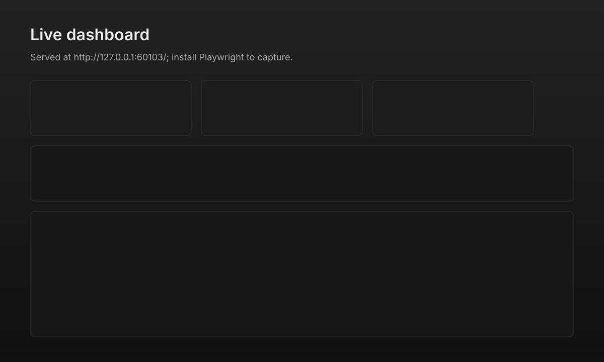
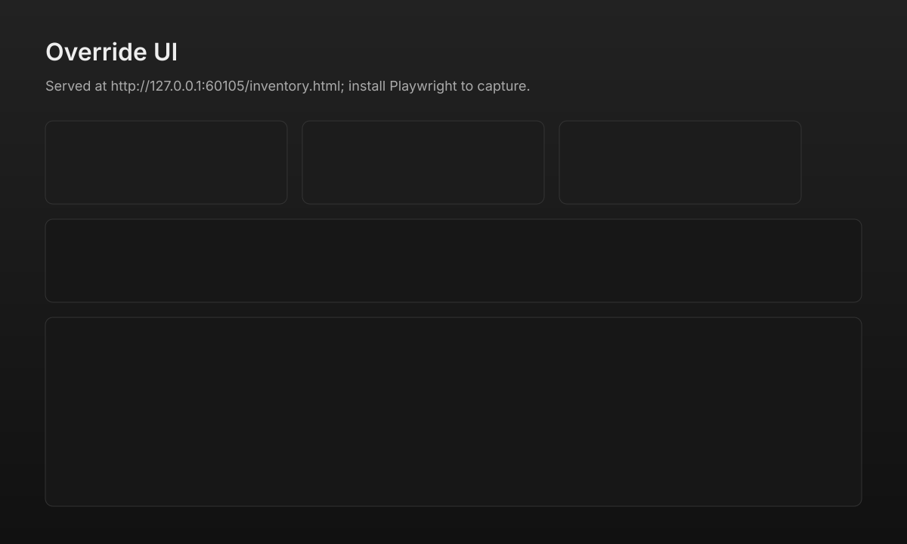

# DiskInventory v2.0

A unified, content-aware disk-space inspector for Windows and Linux/macOS.

DiskInventory detects your environment, walks a configurable set of roots,
classifies every file (rule-based + content signals: MIME, SHA-1 dedup, EXIF
date grouping, name-similarity clustering), produces a deterministic plan,
applies it under your supervision, and lets you watch the whole thing in a
live browser dashboard.

## What's new in v2.0

* **One engine.** Python 3 is canonical; the legacy PowerShell-only tool was
  retired (the v1.1.0 zip stays available on GitHub forever).
* **Live web UI.** `disk-inventory.py run --mode auto --serve` starts a
  dashboard on `http://127.0.0.1:8765` with SSE journal streaming, override
  upload, and pause/resume controls.
* **Content-aware classification.** MIME sniffing (no deps), SHA-1 dedup
  (`--compute-hashes`), EXIF date grouping (`--classify-exif`, optional
  Pillow), name clustering (`--classify-cluster`).
* **Notifications.** Generic webhook (`--notify-webhook URL`) + OS-native
  desktop (BurntToast on Windows, `notify-send` on Linux,
  `terminal-notifier` on macOS).
* **Fleet mode.** `disk-inventory.py fleet scan --hosts hosts.txt`
  SSHes into each host, runs the worker, pulls back artifacts, and
  `fleet dedup` aggregates cross-host SHA-1 duplicates into
  `fleet-dedup.html`.
* **Backward compatible.** v1.1.0 journals restore cleanly. CSV column
  order, environment.json, and overrides.json shapes are preserved.

## Install

```bash
# Linux / macOS
git clone https://github.com/Aminou973/diskinventory.git
cd diskinventory
./disk-inventory.sh --version
```

```powershell
# Windows (PowerShell 5.1+)
git clone https://github.com/Aminou973/diskinventory.git
cd diskinventory
disk-inventory.bat --version
```

Requires Python 3.8 or newer on `PATH` (or `python` on Windows). No
third-party packages required. Optional extras:

```bash
pip install Pillow       # --classify-exif (EXIF date grouping)
pip install pywinrm      # WinRM fleet fallback on Windows workers
```

## Quickstart

```bash
# 1. Snapshot (read-only — safe to run anytime)
disk-inventory.py run --mode report --output-dir out/01-report

# 2. Dry-run (records what *would* happen, no moves)
disk-inventory.py run --mode dryrun --output-dir out/02-dryrun

# 3. Apply under your supervision (or with --yes)
disk-inventory.py run --mode auto --output-dir out/03-auto --serve --open --yes

# 4. Restore if needed
disk-inventory.py restore out/03-auto/actions-journal.jsonl --apply

# 5. Purge old quarantine (30+ days)
disk-inventory.py purge --older-than-days 30
```

## Subcommands

| Command | Purpose |
|---|---|
| `run --mode {report,dryrun,auto}` | Detect → collect → classify → plan → (apply) → export |
| `restore <journal>` | Reverse an actions journal (v1.x and v2 compatible) |
| `purge` | Delete old `_Quarantine/<runId>/` dirs |
| `serve <run_dir>` | Start the dashboard for an existing run |
| `fleet scan --hosts hosts.txt` | SSH into each host, run the worker, fetch outputs |
| `fleet dedup <fleet_dir>` | Cross-host SHA-1 dedup report |
| `migrate <v1-dir> --dst <v2-dir>` | Re-emit a v1.x run dir in v2 layout |

## Outputs

For every run, `out/<runDir>/` contains:

| File | Description |
|---|---|
| `environment.json` | Drives, profiles, heavy caches, scan roots |
| `inventory.csv` | One row per file/dir, 22 columns (18 v1.x + 4 v2 additions) |
| `inventory.md` | Markdown summary |
| `inventory.html` | Offline single-file report with override UI |
| `plan.json` | Deterministic plan (per-path action + destination) |
| `dryrun-journal.jsonl` | What `dryrun`/`auto` *would* do |
| `actions-journal.jsonl` | What `auto` actually did |

## Backward compatibility

The journal format, `environment.json`, CSV column order, and
`overrides.json` are unchanged from v1.1.0. v2.0 adds 4 columns to the
right of the CSV header (`MIMEType`, `DuplicateGroup`, `ExifDate`,
`ClusterId`); v1.1.0 readers see them as unknown columns and ignore them.

To re-emit an old v1.1.0 run dir under the v2 layout:

```bash
disk-inventory.py migrate old-run-dir --dst new-run-dir
```

To serve the dashboard over a v1.1.0 run dir directly:

```bash
disk-inventory.py serve old-run-dir
```

## Dashboard

When `--serve` is passed, a single-page dashboard runs at
`http://127.0.0.1:8765`:

* Live tiles (items, categories, total bytes, applied, errors)
* Categories table
* Top-N by size (paginated, filterable)
* Live journal tail via Server-Sent Events
* Pause / resume controls

Bind defaults to `127.0.0.1`. To expose on the LAN, pass
`--bind 0.0.0.0 --token <secret>` and call clients with
`Authorization: Bearer <secret>`.

### Live dashboard



### Fleet dedup


### Offline override UI (`inventory.html`)



> To regenerate real PNGs from a running run, install Playwright and run
> `python spec/build_screenshots.py`. See
> [docs/SCREENSHOTS.md](docs/SCREENSHOTS.md).

## Fleet mode

`hosts.txt` format (one per line, `#` comments):

```
user@laptop.local
admin@fileserver.local ansible_user=root
workstation port=2222
```

```bash
disk-inventory.py fleet scan --hosts hosts.txt --output-dir fleet-out --compute-hashes
disk-inventory.py fleet dedup fleet-out --top 100 --serve
```

A central SQLite store (`fleet.db`) tracks hosts, runs, items, and
SHA-1 indices for cross-host dedup.

## Layout

```
disk-inventory.py        # entry point
disk-inventory.sh        # Linux/macOS launcher
disk-inventory.bat       # Windows launcher
src/                     # 14 Python modules (cli, env_detect, collect, …)
spec/                    # JSON schemas + golden fixtures
config/                  # base + overlay classification/paths_to_scan
tests/                   # smoke + compat + golden
```

## License

MIT.
